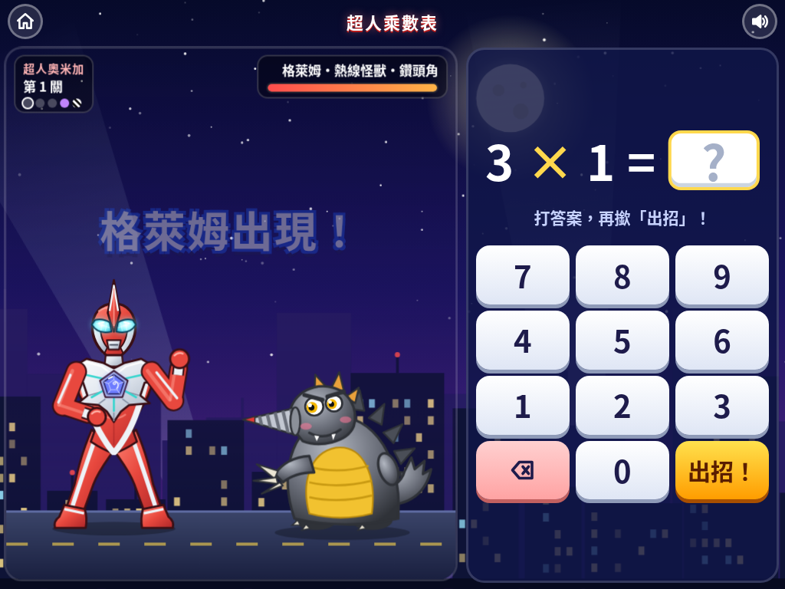
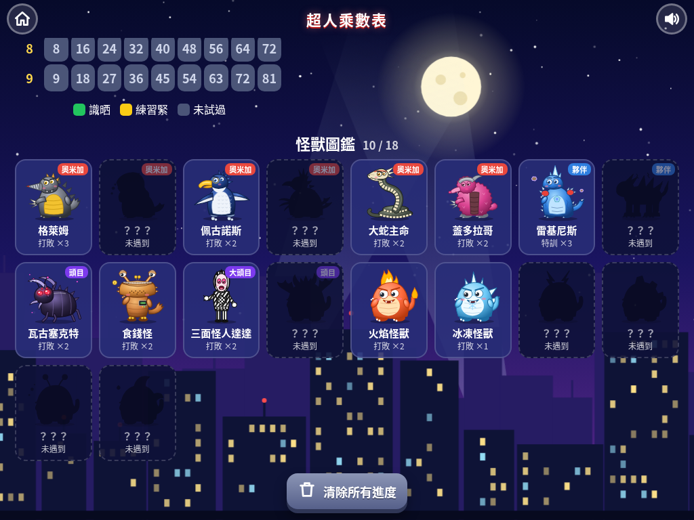

# 超人乘數表

俾二年班小朋友同**超人奧米加**一齊打怪獸、學乘數表！答啱乘數題就可以出招，一路打低怪獸、一路記熟 1 至 10 嘅乘數表，喺 iPad、手機同電腦瀏覽器都玩得。

## ▶️ 即刻玩

**https://jansonlau0126.github.io/ultraman-times/**

## 遊戲截圖

| 主頁：超人奧米加 | 奧米加怪獸：格萊姆 | 必殺技：彩虹旋風斬 | 怪獸圖鑑 |
|---|---|---|---|
|  |  |  |  |

## 玩法

- **學習模式**：逐個乘數表睇、聽傳統九因歌口訣（如／得／歸／中）；學完成個表會記低進度同攞銅勳章。
- **打怪獸**：答啱就出招，連續答啱會出更勁嘅招式；可以揀自己打數字或者多項選擇。每場有 5 關：食錢怪 + 兩隻怪獸 → 中頭目 → 最終大頭目三面怪人達達。
- **計時挑戰**：60 秒內答得幾多題就幾多題（出招動畫期間時計會暫停，公平啲）。
- **我的進度**：乘數表地圖（包括 10 乘數表）、要多啲練習嘅題目、勳章、金幣，仲有**怪獸圖鑑**——打敗過嘅怪獸就會由黑影變成彩色，儲齊 18 隻！

## 超人奧米加

紅色身體加銀色線條、高高嘅頭鰭、發光嘅藍綠色眼、銀色星形胸甲同五角形彩色計時器，擺住戰鬥姿勢——全部係自己用 SVG 畫嘅同人插畫。

## 招式

- 普通招式（輪流出，唔會連續出同一招）：**十字死光**、**光速飛踢**、光輪斬、**爆裂光拳**、**螺旋旋風拳**、**彗星迴旋踢**
- 連續答啱 3 題：**超級十字死光**
- 連續答啱 5 題：**彩虹旋風斬**
- 連續答啱 8 題：**奧米加星煌爆**（最中二必殺！）
- 計時挑戰只用短招（死光／飛踢／光輪／光拳），唔使等長動畫
- 答錯時每隻怪獸有自己嘅反擊（鑽頭突刺、毒液大口、隱形突襲、偽幣彈幕…）

## 怪獸

- **《超人奧米加》怪獸**：格萊姆（鑽頭角）、多格利德（大大口）、佩古諾斯（識飛企鵝）、特利吉拉斯（會隱形）、大蛇主命（超長身）、蓋多拉哥（粉紅毛毛）
- **流星怪獸夥伴**（特訓對手）：雷基尼斯、特萊加隆
- **中頭目**：宇宙甲獸瓦古塞克特、魔王怪獸
- **食錢怪**：錢包形狀、最鍾意食金幣，打敗佢會吐出一大堆金幣！
- **三面怪人達達**（最終大頭目）：黑白條紋，每次被打中都會變面！
- 可愛小怪獸：火焰、冰凍、雷電、岩石、毒霧、海浪怪獸

> 角色全部係自己用 SVG 畫嘅同人插畫，冇用任何官方圖片或者標誌。超人奧米加同各怪獸嘅版權屬圓谷製作所有。怪獸中文名參考中文維基百科／萌娘百科嘅譯名。

## 開發

遊戲係單一檔案 `index.html`，由 `src/` 入面嘅 `style.css`、`body.html`、`art.js`、`game.js` 組成。改完 `src/` 之後執行：

```bash
python3 build.py
```
