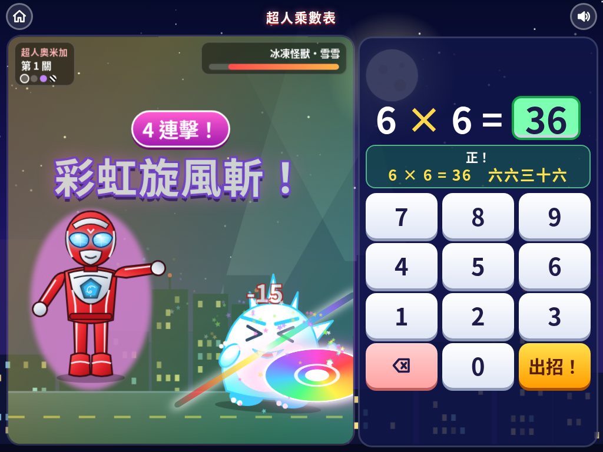
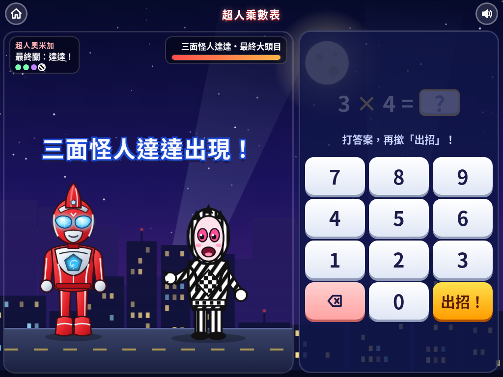

# 超人乘數表

俾二年班小朋友同**超人奧米加**一齊打怪獸、學乘數表！答啱乘數題就可以出招，一路打低怪獸、一路記熟 1 至 10 嘅乘數表，喺 iPad、手機同電腦瀏覽器都玩得。

## ▶️ 即刻玩

**https://jansonlau0126.github.io/ultraman-times/**

## 遊戲截圖

| 主頁：超人奧米加 | 必殺技：彩虹旋風斬 | 最終大頭目：三面怪人達達 |
|---|---|---|
|  |  |  |

## 玩法

- **學習模式**：逐個乘數表睇、聽九因歌口訣。
- **打怪獸**：答啱就出招，連續答啱會出更勁嘅招式；可以揀自己打數字或者多項選擇。
- **計時挑戰**：60 秒內答得幾多題就幾多題。
- **我的進度**：乘數表地圖、要多啲練習嘅題目、勳章、金幣。

## 招式

- 普通招式（輪流出，唔會連續出同一招）：**十字死光**、飛踢、光輪斬、光之拳、**旋風拳**、**超人打關斗**
- 連續答啱 3 題：**超級十字死光**
- 連續答啱 5 題：**彩虹旋風斬**（最強必殺技！）

## 怪獸

- 可愛小怪獸：火焰、雷電、冰凍、海洋怪獸
- **食錢怪**：錢包形狀、最鍾意食金幣，打敗佢會吐出一大堆金幣！
- 魔王怪獸
- **三面怪人達達**（最終大頭目）：黑白條紋，每次被打中都會變面！

> 角色全部係自己用 SVG 畫嘅同人插畫，冇用任何官方圖片或者標誌。超人奧米加、達達、食錢怪等角色版權屬原作者所有。

## 開發

遊戲係單一檔案 `index.html`，由 `src/` 入面嘅 `style.css`、`body.html`、`art.js`、`game.js` 組成。改完 `src/` 之後執行：

```bash
python3 build.py
```
