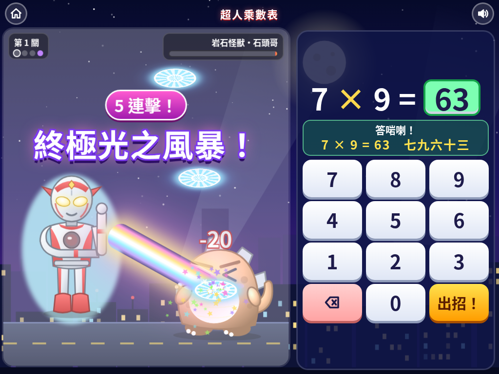

# 超人乘數表

便便二年班小朋友用光之巨人打怪獸嘅方式學乘數表！答啱乘數題就可以發動光線攻擊，一路打低怪獸、一路記熟 1 至 10 嘅乘數表，喺 iPad、手機同電腦瀏覽器都玩得。

## ▶️ 即刻玩

**https://jansonlau0126.github.io/ultraman-times/**

## 遊戲截圖

| 主頁 | 必殺技 | 勝利 |
|---|---|---|
|  |  |  |

## 開發

遊戲係單一檔案 `index.html`，由 `src/` 入面嘅 `style.css`、`body.html`、`art.js`、`game.js` 組成。改完 `src/` 之後執行：

```bash
python3 build.py
```
